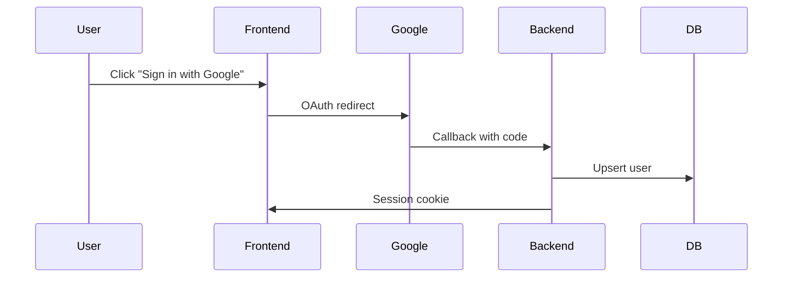

# Artifact Templates

Copy-paste templates for every artifact in the SDD+RPI workflow. Replace bracketed placeholders. Never leave `[TO BE FILLED]` markers — the validator will reject them.

---

## 1. constitution.md

```markdown
# Project Constitution — [Project Name]
> Last updated: YYYY-MM-DD | Version: 1.0.0

## Article 1 — Immutable Principles
- [Non-negotiable rule that applies to every change]
- [e.g., Every public function must have a unit test before merge]
- [e.g., No direct database access from the presentation layer]

## Article 2 — Tech Stack
- **Language:** [e.g., TypeScript 5.4 strict]
- **Runtime:** [e.g., Node.js 22 LTS]
- **Framework:** [e.g., Next.js 15 App Router]
- **Database:** [e.g., PostgreSQL 16 + Prisma]
- **Testing:** [e.g., Vitest + Playwright]
- **CI/CD:** [e.g., GitHub Actions]
- **Infra:** [e.g., Vercel + Supabase]

## Article 3 — Architecture
- **Style:** [e.g., Clean Architecture + DDD]
- **Layers:** [e.g., Presentation → Application → Domain → Infrastructure]
- **State:** [e.g., Server state via React Query, local via Zustand]
- **API style:** [e.g., REST with OpenAPI spec]
- **Boundaries:** [e.g., No imports across feature folders]

## Article 4 — Quality Gates
- Minimum test coverage: [e.g., 80%]
- All linting rules must pass with zero warnings
- All type checks must pass with no `any` (or document each exception)
- PR requires at least 1 human review
- Performance budget: [e.g., LCP < 2.5s, TTI < 3.5s]

## Article 5 — Conventions
- **File naming:** [e.g., kebab-case for files, PascalCase for components]
- **Folder structure:** [e.g., feature-based co-location under `src/features/`]
- **Imports:** [e.g., absolute via `@/` alias, no `../../`]
- **Error handling:** [e.g., Result pattern, no throws in domain layer]
- **Logging:** [e.g., structured JSON via pino]

## Article 6 — Forbidden Patterns
- [e.g., No global mutable state]
- [e.g., No CSS-in-JS — Tailwind only]
- [e.g., No circular dependencies between modules]
- [e.g., No raw SQL strings — always parameterized]

## Article 7 — Required Patterns
- [e.g., All API responses follow `{data, error, meta}` envelope]
- [e.g., All DB access via repository pattern]
- [e.g., All user input validated with Zod schemas]
- [e.g., All external calls wrapped with timeout + retry]

## Article 8 — Security
- [e.g., OWASP Top 10 compliance required]
- [e.g., All secrets in env vars, never committed]
- [e.g., Authentication on every endpoint by default]
- [e.g., Rate limiting on all public endpoints]

## Article 9 — Documentation
- [e.g., All public functions have JSDoc]
- [e.g., All API endpoints documented in OpenAPI]
- [e.g., Architecture Decision Records under `docs/adr/` for major changes]
- [e.g., Every shipped feature has an entry in `.sdd/changelog.md`]
```

---

## 2. research.md

```markdown
# Research — [Feature Name]
> Date: YYYY-MM-DD | Feature: NNN-feature-name | Phase: 1 | Status: Complete

## Summary
[3–5 sentences of facts. Zero opinions. What does the area look like today?]

## Relevant Files
| File | Purpose | Relevance to this feature |
|------|---------|---------------------------|
| `src/modules/auth/login.ts` | Handles login flow | Will need a new branch for SSO |
| `src/shared/types/user.ts` | User type definitions | Must add `ssoProvider` field |

## Existing Patterns
- **Authentication:** JWT with refresh tokens — see `src/middleware/auth.ts:42`
- **Data access:** Repository pattern — see `src/repositories/base.repository.ts:1`
- **Error handling:** `AppError` class — see `src/shared/errors.ts:15`

## Dependencies & Impact
- Changing the `User` type affects: login, profile, settings, admin panel
- DB migration required: add `sso_provider` column to `users`
- API v2 consumers may need a deprecation notice

## Constraints & Risks
- Current session store cannot hold multiple auth providers simultaneously
- Rate limits on third-party SSO callbacks
- Migration MUST be backward-compatible — existing users untouched

## Open Questions
1. Which SSO providers should be supported in v1?
2. Should existing password users be forced to link SSO?
3. What load increase do we expect from SSO adoption?
```

---

## 3. spec.md

```markdown
# Specification — [Feature Name]
> Date: YYYY-MM-DD | Feature: NNN-feature-name | Phase: 2 | Status: Draft

## Problem Statement
[What problem? For whom? Why now? 2–4 sentences.]

## Goals
1. [Measurable goal — e.g., "Users can sign in via Google SSO in under 3 seconds end-to-end"]
2. [Measurable goal]
3. [Measurable goal]

## Non-Goals
1. [Explicitly excluded — e.g., "Apple SSO is out of scope for v1"]
2. [Explicitly excluded]

## User Stories
- **As a** new visitor, **I want to** sign up with Google, **so that** I don't have to create yet another password.
- **As an** existing user, **I want to** link my Google account, **so that** I can choose either login method.

## Acceptance Criteria
- [ ] AC-1: User can click "Sign in with Google" and complete the OAuth flow end-to-end
- [ ] AC-2: After SSO sign-in, user lands on the dashboard
- [ ] AC-3: SSO email matching an existing account links the two
- [ ] AC-4: Failed SSO falls back gracefully to password login

## Edge Cases
| Scenario | Expected Behavior |
|----------|-------------------|
| User cancels SSO mid-flow | Return to login page with neutral message |
| SSO email matches existing password account | Link accounts, notify user via email |
| SSO provider is down | Show fallback to password login with clear message |
| User has 2FA enabled on their Google account | Flow still completes successfully |

## Constraints
- Must work on iOS Safari and Chrome Android
- Auth callback must complete in < 3 seconds at p95
- Must comply with GDPR for SSO-provided user data
- Must not break the existing email/password login
```

---

## 4. plan.md

```markdown
# Technical Plan — [Feature Name]
> Date: YYYY-MM-DD | Feature: NNN-feature-name | Phase: 3 | Status: Draft
> Spec: spec.md | Research: research.md | Constitution: ../../constitution.md

## Architecture Approach
[How this fits into the existing system. Mermaid diagram if helpful.]



## Data Model
- **users table:** add column `sso_provider VARCHAR(32) NULL`
- **users table:** add column `sso_subject VARCHAR(255) NULL`
- **Migration:** `2026XXXX_add_sso_to_users.sql` — additive only, reversible

## API / Interface Contracts
- `GET  /api/auth/google` → redirect to Google OAuth
- `GET  /api/auth/google/callback?code=...` → `{ data: { sessionId }, error: null }`
- `POST /api/auth/link-sso` → links current session user to SSO provider

## Implementation Phases
### Phase A — Database & Types
- Add migration
- Extend `User` type
- Update repository

### Phase B — Backend OAuth Flow
- Add `/api/auth/google` and callback handler
- Add session creation logic for SSO users
- Depends on: Phase A

### Phase C — Frontend Integration
- Add "Sign in with Google" button to login page
- Handle callback and redirect
- Depends on: Phase B

## Testing Strategy
- **Unit:** repository methods, OAuth handler logic
- **Integration:** full callback flow with mocked Google
- **E2E:** Playwright test of the user-visible flow

## Rollback Plan
1. Revert frontend deploy
2. Disable `/api/auth/google` route via feature flag
3. Migration is additive — no rollback needed for the DB

## Constitution Compliance
- [ ] Art 1 (Immutable Principles): all new code has tests
- [ ] Art 2 (Tech Stack): uses approved stack only
- [ ] Art 3 (Architecture): follows clean-arch layering
- [ ] Art 4 (Quality Gates): coverage budget met
- [ ] Art 5 (Conventions): naming, imports, errors all conform
- [ ] Art 6 (Forbidden Patterns): no violations
- [ ] Art 7 (Required Patterns): response envelope, repository, Zod validation all used
- [ ] Art 8 (Security): rate limiting on callback, secrets in env
- [ ] Art 9 (Documentation): OpenAPI updated, changelog stub written
```

---

## 5. plan-review.md

```markdown
# Plan Review — [Feature Name]
> Date: YYYY-MM-DD | Feature: NNN-feature-name | Phase: 4 | Reviewer: [name/agent]

## Summary
[5 lines max — what will be built and how.]

## Risks
1. [Risk + mitigation]
2. [Risk + mitigation]

## Constitution Checklist (re-verified)
| Article | Status | Notes |
|---------|--------|-------|
| Art 1 — Immutable | ✅/❌ | |
| Art 2 — Tech Stack | ✅/❌ | |
| Art 3 — Architecture | ✅/❌ | |
| Art 4 — Quality Gates | ✅/❌ | |
| Art 5 — Conventions | ✅/❌ | |
| Art 6 — Forbidden | ✅/❌ | |
| Art 7 — Required | ✅/❌ | |
| Art 8 — Security | ✅/❌ | |
| Art 9 — Documentation | ✅/❌ | |

## Critic Agent Findings (optional)
[Bullet list of issues a fresh-context agent flagged when re-reading the plan against spec + constitution.]

## Decision
- [ ] ✅ APPROVED — proceed to Tasks
- [ ] 🟡 APPROVED-WITH-CHANGES — list below, update plan, re-review
- [ ] ❌ REJECTED — return to: [Research / Spec / Plan]

## Required Changes (if APPROVED-WITH-CHANGES)
1. [Specific edit]
2. [Specific edit]

## Rejection Reason (if REJECTED)
[Why and which phase to return to.]
```

---

## 6. tasks.md

```markdown
# Tasks — [Feature Name]
> Date: YYYY-MM-DD | Feature: NNN-feature-name | Phase: 5
> Plan: plan.md (APPROVED YYYY-MM-DD)

## Task 1: Add SSO columns to users table
- **Status:** [ ] Pending / [x] Complete / [!] Failed
- **Depends on:** —
- **Files to modify:** `migrations/2026XXXX_add_sso.sql`, `src/db/schema.ts`
- **Changes:** Additive migration adding `sso_provider`, `sso_subject` columns
- **Verification:**
  - [ ] Unit: schema type test
  - [ ] Integration: migration up + down
  - [ ] Manual: inspect DB after migration
- **Estimated complexity:** Low

## Task 2: Extend User type and repository
- **Status:** [ ]
- **Depends on:** Task 1
- **Files to modify:** `src/shared/types/user.ts`, `src/repositories/user.repository.ts`
- **Changes:** Add SSO fields to type; add `findBySsoSubject` method
- **Verification:**
  - [ ] Unit: repository tests
  - [ ] Integration: round-trip test against test DB
- **Estimated complexity:** Low

## Task 3: Implement OAuth callback handler
- **Status:** [ ]
- **Depends on:** Task 2
- **Files to modify:** `src/api/auth/google.ts`, `src/api/auth/google/callback.ts`
- **Changes:** Add Google OAuth redirect + callback with session creation
- **Verification:**
  - [ ] Unit: handler unit tests with mocked Google
  - [ ] Integration: full callback flow
- **Estimated complexity:** Medium
```

---

## 7. verify.md

```markdown
# Verification Reports — [Feature Name]
> Feature: NNN-feature-name | Phase: 7

## Verification Report — Task 1
- **Date:** YYYY-MM-DD
- **Build:** ✅ Pass
- **Tests:** ✅ 142 passed, 0 failed
- **Lint:** ✅ Pass (0 warnings, 0 errors)
- **Types:** ✅ Pass
- **Verdict:** PASS → proceed to Task 2

## Verification Report — Task 2
- **Date:** YYYY-MM-DD
- **Build:** ❌ Fail
  - `error TS2345: Argument of type 'string | null' is not assignable to parameter of type 'string'`
  - File: `src/repositories/user.repository.ts:88`
- **Tests:** Skipped (build failed)
- **Lint:** ✅ Pass
- **Types:** ❌ Fail (see above)
- **Verdict:** FAIL → fix and re-run
```

---

## 8. review.md

```markdown
# Code Review — [Feature Name]
> Date: YYYY-MM-DD | Feature: NNN-feature-name | Phase: 8
> Reviewer: [fresh-context critic agent / human] | Iteration: 1/3

## Acceptance Criteria Validation
| ID | Criterion | Status | Evidence |
|----|-----------|--------|----------|
| AC-1 | User completes Google OAuth | ✅ | `e2e/auth/google.spec.ts:14` |
| AC-2 | Redirect to dashboard after SSO | ✅ | `src/api/auth/google/callback.ts:62` |
| AC-3 | Email match links accounts | ❌ | Not implemented — see issue P0-1 |
| AC-4 | Fallback when provider down | ✅ | `src/api/auth/google.ts:30` |

## Constitution Compliance
| Article | Status | Notes |
|---------|--------|-------|
| Art 1 — Immutable | ✅ | All new code has tests |
| Art 2 — Tech Stack | ✅ | |
| Art 3 — Architecture | ✅ | |
| Art 4 — Quality Gates | ⚠ | Coverage 78%, target 80% |
| Art 5 — Conventions | ✅ | |
| Art 6 — Forbidden | ✅ | |
| Art 7 — Required | ❌ | Response envelope missing in callback — see P1-1 |
| Art 8 — Security | ✅ | Rate limiting present |
| Art 9 — Documentation | ⚠ | OpenAPI not updated |

## Issues Found

### 🔴 P0 — Critical (must fix before ship)
1. **`src/api/auth/google/callback.ts:88`** AC-3 not implemented — existing user with same email is not linked.
   - **Impact:** Breaks acceptance criterion AC-3
   - **Fix:** Add `findByEmail` lookup before creating new user; if found, link SSO subject to existing record.

### 🟡 P1 — Important (should fix)
1. **`src/api/auth/google/callback.ts:62`** Response does not follow `{data, error, meta}` envelope.
   - **Fix:** Wrap response in envelope helper from `src/shared/api/envelope.ts`.
2. **Coverage at 78%** — below the 80% gate.
   - **Fix:** Add tests for the cancel-mid-flow path.

### 🔵 P2 — Minor
1. **`src/api/auth/google.ts:14`** Magic string `"google"` — extract to constant.
2. **`docs/openapi.yaml`** Missing new endpoints.

## Quality Scores
| Dimension | Score | Notes |
|-----------|-------|-------|
| Readability | 4/5 | Clear, but callback handler is dense |
| Maintainability | 4/5 | |
| Test Coverage | 3/5 | Below target |
| Error Handling | 3/5 | Missing branch for AC-3 |
| Performance | 5/5 | Within budget |

## Iteration History
| # | Date | Issues found | Issues fixed | Remaining |
|---|------|--------------|--------------|-----------|
| 1 | YYYY-MM-DD | 5 | 0 | 5 |

## Decision
- [ ] ✅ APPROVED — Ready to ship
- [x] 🔄 ITERATE — Fix P0 + P1 (next iteration: 2/3)
- [ ] ❌ REJECT — Return to: [phase + reason]
```

---

## 9. ship.md

```markdown
# Ship Report — [Feature Name]
> Date: YYYY-MM-DD | Feature: NNN-feature-name | Phase: 10

## Summary
[1–2 sentences on what was delivered.]

## Delivery Checklist
- [x] All tasks complete (`tasks.md`)
- [x] All verifications pass (`verify.md`)
- [x] Code review approved (`review.md`)
- [x] Commit/PR created and linked
- [x] README updated (if needed)
- [x] Changelog updated (`.sdd/changelog.md`)
- [x] Spec marked SHIPPED with date

## Changes Made
| File | Change | Description |
|------|--------|-------------|
| `migrations/2026XXXX_add_sso.sql` | Added | SSO columns migration |
| `src/api/auth/google.ts` | Added | OAuth redirect endpoint |
| `src/api/auth/google/callback.ts` | Added | OAuth callback handler |
| `src/components/LoginButton.tsx` | Modified | Added "Sign in with Google" |

## Known Limitations
- Apple SSO not supported (out of scope, see spec non-goals)
- Account-link UI lives in settings only, no inline prompt yet

## Lessons Learned
- **Went well:** Repository pattern made the SSO integration trivial
- **Painful:** Mocking Google OAuth in integration tests took longer than expected
- **Constitution update suggested?** Yes — add Article 8 rule: "All OAuth flows must use rate limiting"
```

---

## 10. Status Dashboard (optional, useful for `/sdd-status`)

```markdown
# SDD Status — [Project Name]
> Last updated: YYYY-MM-DD

## Active Features
| # | Feature | Phase | Progress | Blocker |
|---|---------|-------|----------|---------|
| 001 | google-sso | Implement | ████░░░░░░ 60% | — |
| 002 | export-csv | Plan Review | ████░░░░░░ 40% | Awaiting human approval |

## Phase Progress Key
| Phase | Approx. % |
|-------|-----------|
| Constitution | 0% (permanent) |
| Research | 10% |
| Spec | 20% |
| Plan | 30% |
| Plan Review | 40% |
| Tasks | 50% |
| Implement | 60% |
| Verify | 70% |
| Code Review | 80% |
| Iterate | 85% |
| Ship | 100% |

## Recently Shipped
| # | Feature | Date | Quality Score |
|---|---------|------|---------------|
| 000 | initial-setup | YYYY-MM-DD | 4.6/5 |
```
